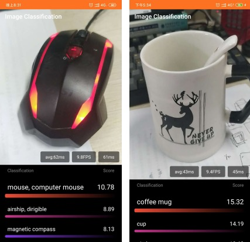
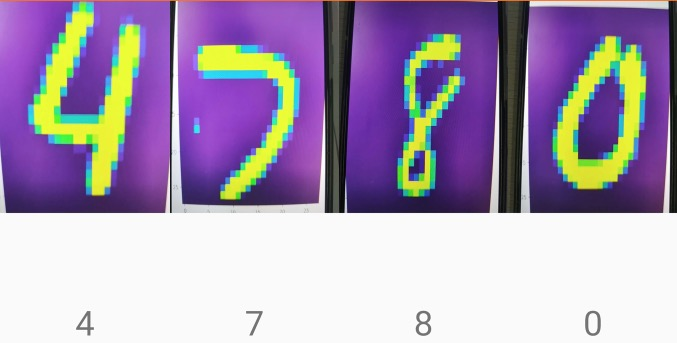
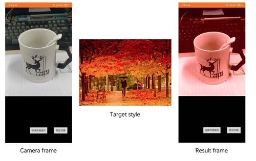

# Android-Vision
## Table of Contents

 * [Introduction](#introduction)
 * [Features](#Features)
 * [Requirements](#Requirements)
 * [Demo](#Demo)
 * [ToDo](#ToDo)

## Introduction
[Android-Vision](https://github.com/zhangliukun/android-vision) is an android application that implements some popular computer vision algorithms. For the convenience of the development, It has integrated some common libraries such as OpenCV, pytorch, tensorflow, OpenGL. What's more, It provides many useful utils which can save you lots of time.

Your star is my greatest encouragement！

Welcome to make suggestions on my work! ORZ~

## Features
- **Image Classification:** Classify the image acquired by the Camera through the MobileNetV2 or the Resnet18, which is trained by pytorch.
- **Mnist Classification:** Classify the handwritten number image acquired by the Camera through a custom small neural network, which is a pytorch model.
- **Object Detection:** Analyze the image acquired by the Camera and classify objects selected by the bounding boxes.
- **Color Transfer:** Transfer the camera frame's color space to the target image's color space in real time. It is awesome!
- **OpenGLES Camera2:** It can output camera frame to the OpenGL extended,which can realize the gray filter using the shader. What's more, It also can convert the YUV camera frame to RGB bitmap and process the data using our own method such as the native code or the neural network. In the end, It can output the result to our own texture.
- **ARcore:** It can place your 3D model to the real planes through the camera. What's more, it also can convert the color to the style you like by the template picture. The ARcore API and the Huaiwei ARengine API are very similar, in this project I use the latter because my test mobile phone is Huaiwei p40 which is not supported by the ARcore.

## Requirements
- JDK 1.8
- Cmake 3.10.2
- pytorch_android 1.4.0
- pytorch_android_torchvision 1.4.0
- tensorflow-lite 0.0.0-nightly
- OpenCV-android-sdk 3.0.0

## Demo
### **Image Classification:**

### **Mnist Classification:**

### **Object Detection:**

### **Color Transfer:**

### **OpenGLES Camera2:**

### **ARcore**

## ToDo
- [✔️]Add the ARcore library and realize the Smart Home demo, which can place our own 3D model to the real word.
- Combine some popular AI projects such as Object detection to the AR world, which can be call AIR(AI+AR)
- Refactor the code.
